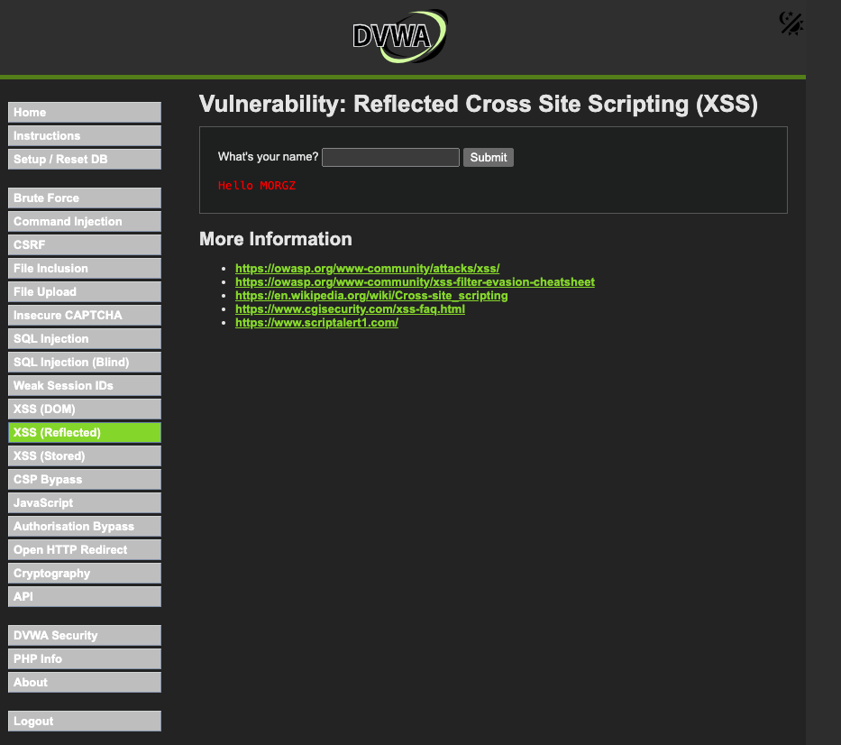
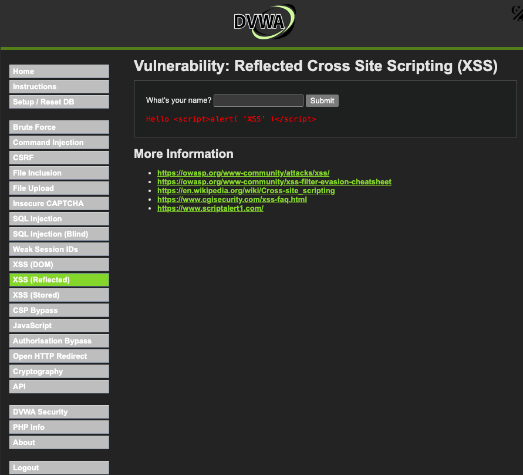

 DVWA XSS (Reflected) Lab

**Platform:** DVWA  
**Skills Practiced:** Cross-Site Scripting (XSS), Web Input Validation  

## Summary
In this lab, I tested the **XSS (Reflected)** vulnerability in DVWA.  
I first submitted normal input, then injected a JavaScript payload to trigger an alert popup.  

## Steps Taken
1. Logged into DVWA and navigated to **XSS (Reflected)**.
2. Submitted normal input (`Nogoi`) and observed reflection.
3. Submitted XSS payload ``.
4. Observed alert popup confirming script execution.
5. Captured screenshots of the process.

## Screenshots  

### Normal Input vs XSS Payload  

| Normal Input | XSS Payload Executed |
|--------------|----------------------|
|  |  |

## Learning Outcome
- Understood how **reflected XSS** works in practice.  
- Learned why developers must validate and sanitize all user inputs.  
- Gained hands-on penetration testing experience with web applications.

